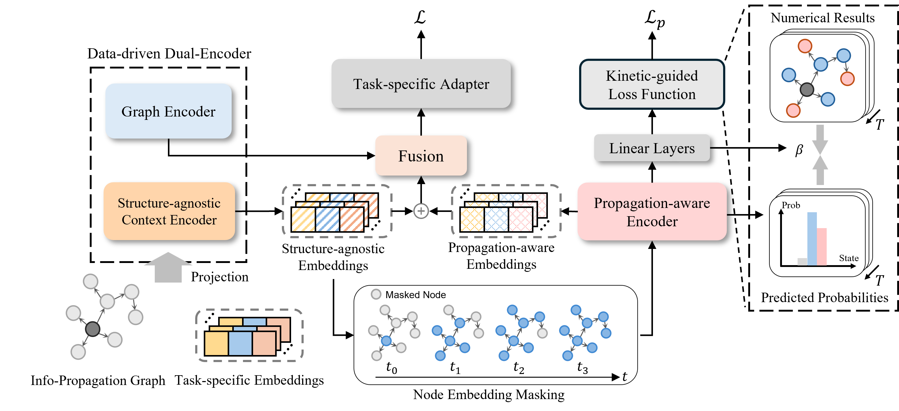

# RPRL

This repository is the implementation of International Conference of Data Mining (ICDM2025) paper: Towards Propagation-aware Representation Learning for Supervised Social Media Graph Analytics

## Download Dataset and Run

Download dataset from this anonymous link: https://drive.google.com/file/d/1-wA-Z8nY3ymelgq_7JwBZDDKKqZ30BIv/view?usp=drive_link

and place the 'dataset' folder in the home directory.

run main.py to train and test the model.

## Requirements:
- python==3.12
- pytorch==2.3.1
- torch_geometric==2.5.3
- tqdm==4.66.4
- sklearn==1.5.0
- scipy==1.14.0
- numpy==1.26.4
- pandas==2.2.2
- jieba==0.42.1
- nltk==3.8.1
- gensim==4.3.2
- transformers==4.42.3
- yaml==0.2.5
